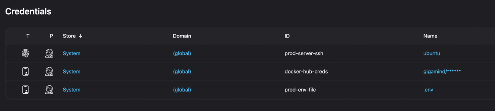
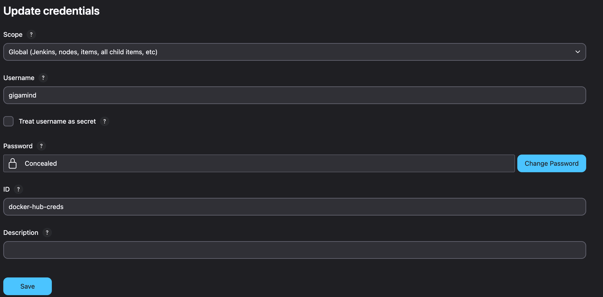
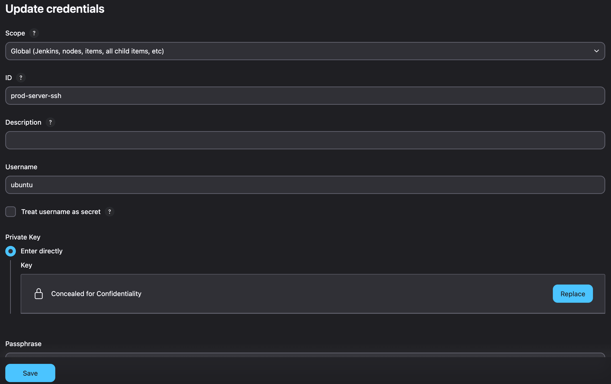
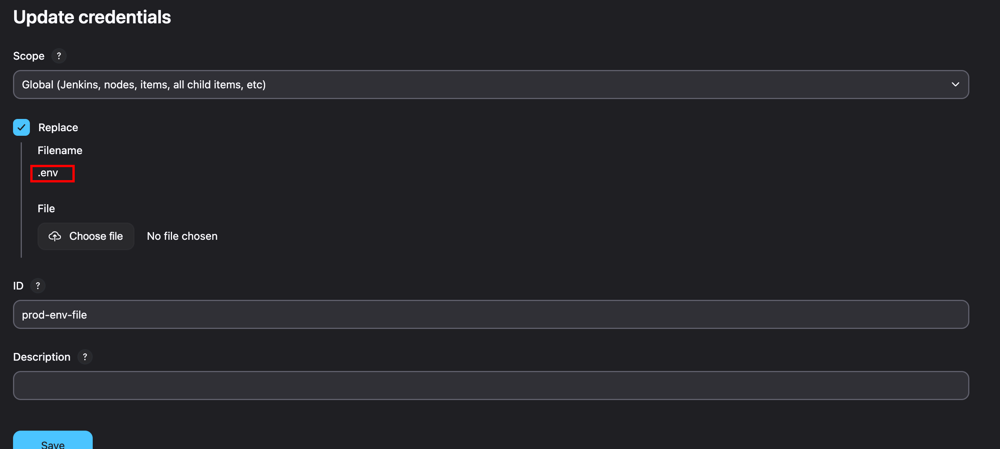

# Flask API

## Как запустить проект локально

### 1. Клонировать репозиторий

```bash
git clone https://github.com/Egoruto/lesta_final_project.git
cd lesta_final_project
```

### 2. Подготовить переменные окружения

Создайте файл `.env` на основе шаблона:

```bash
cp .env.example .env
```

Заполните параметры в `.env` (POSTGRES\_USER, POSTGRES\_PASSWORD, POSTGRES\_DB и т.д.).

### 3. Запустить проект через Docker Compose

```bash
docker compose up --build -d
```

### 4. Проверка API

```bash
curl http://localhost:5050/ping
```

---

## Как настроить Jenkins

### 1. Установить плагины Jenkins

* Pipeline
* Docker Pipeline
* SSH Agent
* Git

### 2. На машине с Jenkins должен быть установлен docker

Проверить можно командой

```
docker --version
```
Если нет, то установить можно воспользовавшись инструкцией отсюда
https://docs.docker.com/engine/install/

### 2. Добавить креды в Jenkins:

Manage Jenkis -> Credentials -> Add Credentials

* **docker-hub-creds** — username/password (для пуша образа)



* **SSH ключ** — для доступа на целевой сервер



* добавить файл .env как secret file



### 4. Создать два отдельных pipeline в Jenkins:

Сделано это для того чтобы сразу проверить сборку, а потом уже заливать на прод


#### Pipeline: **flask-api-build**
При создании Pipline установить следующее
* Definition - Pipeline script from SCM
* SCM - Git
* Repository URL - https://github.com/Egoruto/lesta_final_project.git
* Branch Specifier - main
* Script Path - Jenkinsfile.build

#### Pipeline: **flask-api-deploy**
В этом Pipeline указать все тоже самое кроме _Script Path_
* Script Path - Jenkinsfile.deploy

### 5. Подключение к целевой машине

Jenkins подключается через ssh используя учетные данные из настроенного пользователя.

Сам путь подключения прописан в Jenkinsfile.build

---
## Настройка целевой машины

### 1. Создайте диреткорию для проекта

`sudo mkdir /opt/flask-api`
### 2. Измените группу директории

`sudo chgrp <имя_пользователя> /opt/flask-api/`

### 3. Измените права директории

`sudo chmod 775 -R /opt/flask-api/`

### 3. Также на целевой мащине должен быть установлен docker

Проверить можно командой

```
docker --version
```
Если нет, то установить можно воспользовавшись инструкцией отсюда
https://docs.docker.com/engine/install/


## Как работает CI/CD

1️⃣ **Build Pipeline:**

* Jenkins клонирует репозиторий.
* Собирает Docker-образ: `gigamind/flask-api:latest`.
* Запускает линтер внутри образа: `flake8 app/`.
* Пушит собранный образ в Docker Hub.

2️⃣ **Deploy Pipeline:**

* Jenkins подключается к прод-серверу по SSH.
* Копирует свежий `docker-compose.yml` и `.env` в `/opt/flask-api`.
* Запускает `docker compose pull && docker compose up -d` на сервере.

---

## Примеры API-запросов

_Вместо <ip-server> поставить ip адрес целевой машины._

### Проверка работоспособности


```bash
curl http://<ip-server>:5050/ping
```

Ответ:

```json
{"status": "ok"}
```

### POST-запрос для отправки данных

```bash
curl -X POST http://<ip-server>:5050/submit \
  -H "Content-Type: application/json" \
  -d '{"name": "Egor", "score": 88}'
```

### Получение всех данных (GET)

```bash
curl http://<ip-server>:5050/results
```
